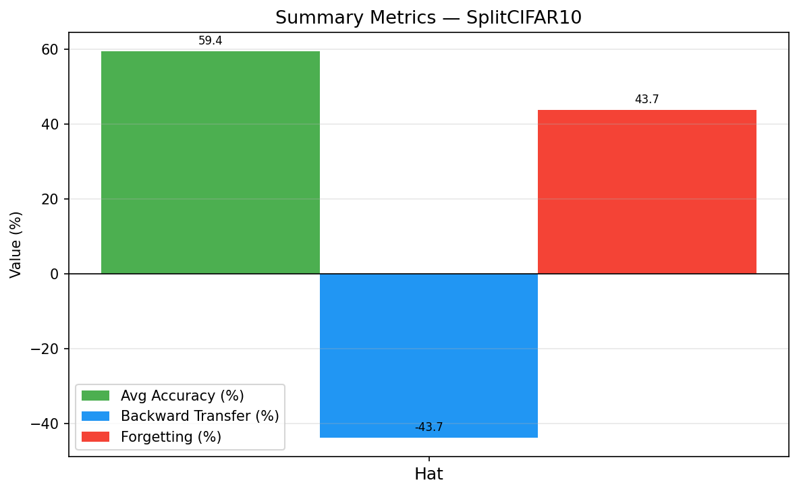

# Modular Continual Network (MCN)

A novel neural network architecture for continual learning that achieves near-zero catastrophic forgetting by growing modular capacity per task, rather than competing over fixed weights.

## Key Results

| Method      | Split-CIFAR-10 (5 tasks) | Split-CIFAR-100 (20 tasks) | Permuted MNIST (5 tasks) |
|-------------|:------------------------:|:--------------------------:|:------------------------:|
|             | Avg Acc / Forgetting     | Avg Acc / Forgetting       | Avg Acc / Forgetting     |
| Naive       | 50.7% / 55.6%            | 23.8% / 64.4%              | 87.5% / 12.8%            |
| EWC         | 60.8% / 39.2%            | 66.0% / 11.3%              | 96.8% / 1.0%             |
| PackNet     | 77.0% / 9.3%             | 56.2% / 4.5%               | 95.4% / 3.0%             |
| HAT         | 59.4% / 43.7%            | —                          | —                        |
| **MCN**     | **92.7% / 0.1%**         | **75.1% / 1.5%**           | **95.9% / 1.2%**         |

### Plots

| Split-CIFAR-10 | Split-CIFAR-100 | Permuted MNIST |
|:-:|:-:|:-:|
|  |  |  |
|  |  |  |

## Architecture

```
Input ──► base_low  [frozen after Task 0]  ──► base_high ──► base_feat (512d)
    │      Block 1+2: edges & textures           Block 3+FC         │
    │                                                               │
    └──► TaskModule[t] ─────────────────────────────► task_feat ───┤
          Lightweight CNN adapter (new per task)        (256d)      │
                                                                    ▼
                                                              Router[t]
                                                         (per-sample attn)
                                                                    │
                                                                    ▼
                                                             Head[t] → logits
```

**Core insight:** Instead of all tasks competing over the same fixed weights (causing forgetting), each new task gets its own dedicated module. The base encoder learns general low-level features on Task 0 and is frozen — those representations never degrade. New tasks grow their own capacity.

**Why this beats EWC and PackNet:**
- EWC: soft penalty accumulates and eventually restricts new task learning
- PackNet: hard masks work but network runs out of capacity
- MCN: no capacity limit — add a module, add capacity

## Setup

```bash
python3 -m venv .venv
source .venv/bin/activate
pip install -r requirements.txt
```

## Usage

```bash
# Run all methods on Split-CIFAR-10
python main.py --benchmark cifar10 --methods naive ewc packnet mcn --epochs 10

# Run all methods on Split-CIFAR-100 (20 tasks — the hard benchmark)
python main.py --benchmark cifar100 --methods naive ewc packnet mcn --epochs 10

# Run on Permuted MNIST
python main.py --benchmark mnist --methods naive ewc packnet mcn --epochs 10

# Run ablation study
python main.py --methods mcn mcn_no_router mcn_no_gate mcn_base_only --tasks 3 --epochs 5

# Run only MCN, more epochs
python main.py --methods mcn --epochs 20 --benchmark cifar100
```

## Ablation Study

| Variant         | Avg Acc | Forgetting | What it proves                        |
|-----------------|:-------:|:----------:|---------------------------------------|
| MCN (full)      | 89.2%   | 0.3%       | Full architecture                     |
| No Router       | 87.7%   | 0.1%       | Attention blending adds +1.5% acc    |
| No Gate         | 89.7%   | 0.0%       | Gate stabilizes early training        |
| Base Only       | 71.7%   | 0.4%       | Task modules essential (+17.5% acc)   |

## Project Structure

```
continual-learning-arch/
├── benchmarks/
│   ├── split_cifar10.py     # 5-task CIFAR-10
│   ├── split_cifar100.py    # 20-task CIFAR-100 (hard benchmark)
│   └── permuted_mnist.py    # 5-task Permuted MNIST
├── models/
│   ├── backbone.py          # CNN/MLP backbones for baselines
│   ├── ewc.py               # Elastic Weight Consolidation
│   ├── packnet.py           # PackNet (prune & freeze)
│   ├── mcn.py               # Modular Continual Network (ours)
│   └── mcn_ablations.py     # MCN ablation variants
├── trainers/
│   ├── naive_trainer.py     # Sequential SGD baseline
│   ├── ewc_trainer.py       # EWC training loop
│   ├── packnet_trainer.py   # PackNet two-phase training
│   └── mcn_trainer.py       # MCN adaptive-freezing trainer
├── utils/
│   ├── device.py            # MPS/CUDA/CPU device selection
│   ├── metrics.py           # AA, BWT, Forgetting Measure
│   └── visualization.py     # Result plots
├── results/                 # Experiment outputs
└── main.py                  # CLI experiment runner
```

## Metrics

- **Average Accuracy (AA):** Mean accuracy across all tasks after final task
- **Backward Transfer (BWT):** How much learning new tasks hurt old ones (negative = forgetting)
- **Forgetting Measure (FM):** Average drop from peak accuracy per task

## Hardware

Developed and tested on Apple M4 MacBook using MPS (Metal Performance Shaders) acceleration. Automatically detects MPS/CUDA/CPU.

## Citation

```bibtex
@misc{mcn2025,
  title={Modular Continual Network: Growing Capacity for Zero-Forgetting Continual Learning},
  author={},
  year={2025},
  note={Preprint}
}
```
